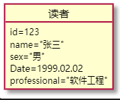
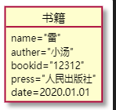
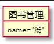
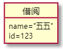
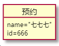
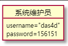

# 实验2：图书管理系统用例建模

|学号|班级|姓名|
|:-------:|:-------------: | :----------:|
|201710414116|软工1班|汤顺|

## 1.图书管理系统的用例关系图

### 1.1 用例图PlantUML源码如下：

```
@startuml

usecase (借出图书)
usecase (借阅图书)
usecase (归还图书)
usecase (系统管理)
usecase (维护读者信息)
usecase (查询图书)
usecase (查询借阅情况)
usecase (预定图书)
usecase (取消预订)

actor :图书管理员:
actor :读者:
actor :系统维护员:

:系统维护员: --> (维护读者信息)
:系统维护员: --> (系统管理)

:图书管理员: --> (查询图书)
:图书管理员: --> (借出图书)

:读者: --> (查询图书)
:读者: --> (借阅图书)
:读者: --> (预定图书)

(借出图书) --> (借阅图书)
(借阅图书) --> (归还图书)
(查询图书) --> (查询借阅情况)
(预定图书) --> (取消预订)

@enduml
```

### 1.2 用例图如下：


## 2. 参与者说明

### 2.1图书管理员
主要职责是：管理图书馆所有的书籍借出与归还

### 2.2读者
主要职责是：在图书管中借阅图书与归还图书

### 2.3系统维护员
主要职责是：在图书馆中管理读者信息与维护图书管理系统

## 3. 用例规约表

### 3.1 “借阅图书”用例

#### “借阅图书”用例流程图源代码：
```
@startuml
start
:选择一本书;
if (所选书籍剩余量为0？) then (yes)
  :输出提示：书籍没有库存了;
    stop
elseif (达最大借书量？) then (yes)
  :提示已经到达最大借书量;
  stop
elseif (存在超过归还期限的书籍？) then (yes)
  :提示请先归还超时书籍;
    stop
else (no)
  :系统确认;
endif
:请求读者确认;
if (读者确认？) then (yes)
  :借阅成功;
else (no)
  :取消借阅;
endif
stop
@enduml
```
#### “借阅图书”流程图

#### “借阅图书”用例规约


### 3.2 “归还图书”用例


#### “归还图书”用例流程图源代码：
```
@startuml
start
:系统显示归还界面并提
示读者操作自动还书机;
:按照指导完成操作;
if (系统没有获得书籍信息？) then (yes)
  :提示请按照操作提示，规范使用还书机;
    stop
elseif (系统连续三次获取图书失败？) then (yes)
  :提示没有输入存放地址;
  if (系统提示还书出现错
  误是否呼叫工作人员？) then (yes)
  :已呼叫工作人员，请稍等;
  stop
    else (no)
    stop
  endif
  stop
elseif (读者存在有超时的书籍？) then (yes)
  :提示读者请先归还超时书
  籍并显示所有已经超时的书籍;
    stop
else (no)
  :系统获得书籍信息、
  读者信息并提示读者;
endif
if (读者确认？) then (yes)
  :还书成功;
else (no)
  :取消还书;
endif
stop
@enduml
```
#### “归还图书”流程图

#### “归还图书”用例规约


### 3.3 “系统管理”用例

#### “系统管理”用例流程图源代码：
```
@startuml
start
:系统维护员进入系统;
:查看系统信息;
:查看用户信息;
:系统显示用户信息;
:用户信息加密;
stop
@enduml
```
#### “系统管理”流程图

#### “系统管理”用例规约


### 3.4 “查询图书”用例

#### “查询图书”用例流程图源代码：
```
@startuml
start
:系统显示图书搜索框;
if (选择名称查询？) then (yes)
  :系统使用名称查询;
else (no)
  :系统使用编码查询;
endif
:查询;
if (查询到内容？) then (yes)
  :系统返回查找的书籍并显示，存放地址，剩余数量;
else (no)
  :系统提示没有找到任何书籍;
endif
stop
@enduml
```
#### “查询图书”流程图

#### “查询图书”用例规约


### 3.5 “预订图书”用例

#### “预订图书”用例流程图源代码：
```
@startuml
start
:用户;
:提交一次预订请求;
:图书管理员选择“预订登记”
提交“预订登记”请求;
:系统显示“预订登记”空白窗口;
:用户填写预订登记信息;
:系统显示该读者想要预订图书的信息;
stop
@enduml
```
#### “预订图书”流程图

#### “预订图书”用例规约

### 3.6 “取消预订”用例

#### “取消预订”用例流程图源代码：
```
@startuml
start
:用户参与取消预订;
:图书管理员选择“取消预定登记”
提交“取消预定登记”请求 。;
:系统显示“取消预定登记”空白窗口。;
:用户输入预定登记信息;
:系统列表显示该读者想要预定的图书信息。;
:用户选择取消预定;
if(用户之前是否进行过预定？) then (yes)
    :取消预订成功;
    stop
else(no)
    :用户没有进行预定但想取消预定;
    :提示用户取消预定失败;
stop
@enduml
```
#### “取消预订”流程图

#### “取消预订”用例规约
