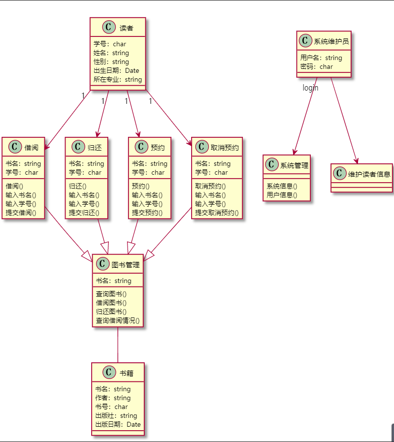
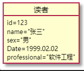
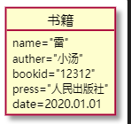
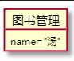
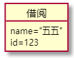
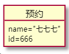
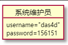

# 实验3：图书管理系统领域对象建模

|学号|班级|姓名|
|:-------:|:-------------: | :----------:|
|201710414116|软工1班|汤顺|

## 1.图书管理系统的类图

### 1.1 类图PlantUML源码如下：

```
@startuml

class 读者{
  学号：char
  姓名：string
  性别：string
  出生日期：Date
  所在专业：string
}
class 借阅{
  书名：string
  学号：char
  借阅()
  输入书名()
  输入学号()
  提交借阅()

}
class 归还{
  书名：string
  学号：char
  归还()
  输入书名()
  输入学号()
  提交归还()
}
class 预约{
  书名：string
  学号：char
  预约()
  输入书名()
  输入学号()
  提交预约()
}
class 取消预约{
  书名：string
  学号：char
  取消预约()
  输入书名()
  输入学号()
  提交取消预约()
}
class 图书管理{
  书名：string
  查询图书()
  借阅图书()
  归还图书()
  查询借阅情况()
}
class 书籍{
  书名：string
  作者：string
  书号：char
  出版社：string
  出版日期：Date
}
class 系统维护员{
  用户名：string
  密码：char
}
class 系统管理{
  系统信息()
  用户信息()
}
class 维护读者信息{
  
}
读者 "1"--> 借阅
读者 "1"--> 归还
读者 "1"--> 预约
读者 "1"--> 取消预约
借阅 --|> 图书管理
归还 --|> 图书管理
预约 --|> 图书管理
取消预约 --|> 图书管理
图书管理 -- 书籍
系统维护员 "login"--> 系统管理 
系统维护员 --> 维护读者信息
@enduml
```

### 1.2 类图如下：


### 1.3类图说明

读者在图书管中借阅图书与归还图书  
系统维护员在图书馆中管理读者信息与维护图书管理系统  
读者可通过输入信息后查询、借阅、归还、预约、取消预约等一系列操作  
查询、借阅、归还、预约、取消预约这一系列操作都属于图书管理的一部分  


## 2. 图书管理系统的对象图

### 2.1 类“读者”对象图
#### 源码
```
@startuml
object 读者{
id=123
name="张三"
sex="男"
Date=1999.02.02
professional="软件工程"
}
@enduml
```
#### 图


### 2.2 类“书籍”对象图
#### 源码
```
@startuml
object 书籍{
  name="雷"
  auther="小汤"
  bookid="12312"
  press="人民出版社"
  date=2020.01.01
}
@enduml
```
#### 图


### 2.3 类“图书管理”对象图
#### 源码
```
@startuml
object 图书管理{
  name="汤"
}
@enduml
```
#### 图


### 2.4 类“借阅”对象图
#### 源码
```
@startuml
object 借阅{
  name="五五"
  id=123
}
@enduml
```
#### 图


### 2.5 类“借阅”对象图
#### 源码
```
@startuml
object 预约{
  name="七七七"
  id=666
}
@enduml
```
#### 图


### 2.6 类“系统维护员”对象图
#### 源码
```
@startuml
object 系统维护员{
  username="das4d"
  password=156151
}
@enduml
```
#### 图
