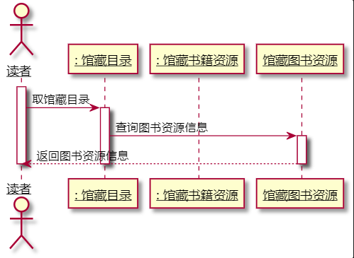

# 实验4：图书管理系统顺序图绘制

|学号|班级|姓名|
|:-------:|:-------------: | :----------:|
|201710414116|软工1班|汤顺|

## 1.借阅图书

### 1.1.借阅图书用例顺序图源码

```
@startuml
actor ": 图书管理员" as 图书管理员
participant ": 读者" as 读者
participant ": 馆藏目录" as 馆藏目录
participant ": 馆藏书籍资源" as 馆藏书籍资源
participant ": 借书记录" as 借书记录
skinparam sequenceParticipant underline
图书管理员 -> 读者:验证读者
activate 图书管理员
loop
activate 读者
deactivate 读者
图书管理员 -> 读者:取读者限额
activate 读者
opt 超出限额
读者-->图书管理员:取消借书操作
deactivate 读者
end
图书管理员 -> 馆藏目录:获取馆藏目录
activate 馆藏目录
馆藏目录 -> 馆藏书籍资源:查找书籍资源
activate 馆藏书籍资源
deactivate 馆藏书籍资源
deactivate 馆藏目录
图书管理员 -> 借书记录:创建借书记录
activate 借书记录
deactivate 借书记录
图书管理员 -> 馆藏目录:借出资源
activate 馆藏目录
馆藏目录 -> 馆藏书籍资源:减少可借数量
activate 馆藏书籍资源
deactivate 馆藏书籍资源
deactivate 馆藏目录
图书管理员 -> 读者:减少可借限额
activate 读者
deactivate 读者
end
图书管理员 -> 借书记录:打印借书清单
activate 借书记录
deactivate 借书记录
deactivate 图书管理员
@enduml
```
### 1.2.借阅图书用例顺序图

### 1.3.借阅图书用例顺序图说明
读者借书时，读者将借阅书籍与读者卡交与管理员，管理员判断对书籍与读者分别进行验证，验证读者是否存在借书条件，
并判断读者借书限额，

之后查询书籍信息与品种，两种验证均通过的情况下，借书成功，减少库内书籍数量，减少读者可借书数，一次借书操作完成，

在借书操作循环完成后，打印读者借书清单。
## 2.归还图书用例顺序图

### 2.1.归还图书用例顺序图源码
```
@startuml
actor ": 图书管理员" as 图书管理员
participant ": 读者" as 读者
participant ": 馆藏目录" as 馆藏目录
participant ": 馆藏书籍资源" as 馆藏书籍资源
participant ": 借书记录" as 借书记录
skinparam sequenceParticipant underline
图书管理员 -> 读者:验证读者信息
activate 读者
deactivate 读者
loop
图书管理员 -> 馆藏目录:读取馆藏目录
activate 图书管理员
activate 馆藏目录
馆藏目录 -> 馆藏书籍资源:获取书籍资源
activate 馆藏书籍资源
deactivate 馆藏书籍资源
deactivate 馆藏目录
图书管理员 -> 借书记录:取借书记录
activate 借书记录
借书记录 --> 图书管理员:借书记录
deactivate 借书记录
图书管理员 -> 馆藏目录:归还资源
activate 馆藏目录
馆藏目录 -> 馆藏书籍资源:增加可借数量
activate 馆藏书籍资源
deactivate 馆藏书籍资源
deactivate 馆藏目录
图书管理员 -> 借书记录:登记还书日期
activate 借书记录
deactivate 借书记录
opt 逾期
图书管理员 -> 借书记录:打印还书清单
activate 借书记录
deactivate 借书记录
@enduml
```
### 2.2.归还图书用例顺序图

### 2.3.归还图书用例顺序图说明
读者归还图书时，将需要归还的书籍和读者卡交给图书管理员，图书管理员首先对读者进行验证，验证是否读者是否可借还书，

通过验证后，依次读取馆藏目录与馆藏书籍资源，验证书籍与品种信息是否存在馆藏信息中，存在则继续进行归还处理，

图书管理员读取读者借书记录，查找读者是否正在借阅该图书，如果是就归还图书。

## 3.查询图书

### 3.1.查询图书用例顺序图源码
```
@startuml
actor 读者
actor ": 读者" as 读者
participant ": 馆藏目录" as 馆藏目录
participant ": 馆藏书籍资源" as 馆藏书籍资源
skinparam sequenceParticipant underline
activate 读者
读者->馆藏目录:取馆藏目录
activate 馆藏目录
馆藏目录->馆藏图书资源:查询图书资源信息
activate 馆藏图书资源
馆藏图书资源-->读者:返回图书资源信息
deactivate 馆藏图书资源
deactivate 馆藏目录
deactivate 读者
@enduml
```
### 3.2.查询图书用例顺序图

### 3.3.查询图书用例顺序图说明
读者进行查询书目操作时，先取馆藏目录，根据馆藏目录选择馆藏书籍资源，并查询相关信息，不管是否查询到书籍信息都需要返回给读者

## 4.预定图书用例顺序图

### 4.1.预定图书用例顺序图源码
```
@startuml
actor ": 读者" as 读者
participant ": 预定记录" as 预定记录
participant ": 馆藏目录" as 馆藏目录
participant ": 馆藏书籍资源" as 馆藏书籍资源
skinparam sequenceParticipant underline
activate 读者
读者->读者:验证读者信息
loop
读者->馆藏目录:取馆藏目录
activate 馆藏目录
馆藏目录->馆藏书籍资源:查询书目
activate 馆藏书籍资源
deactivate 馆藏书籍资源
deactivate 馆藏目录
读者->预定记录:查询可预定数目
activate 预定记录
预定记录-->读者:可预定数目大于0
opt
预定记录-->读者:可预定数目为0
end
读者->预定记录:查询已预定书籍信息
预定记录-->读者:未预定当前需要预定图书
opt
预定记录-->读者:已预定当前需要预定图书
end
读者->预定记录:登记预定记录
deactivate 预定记录
end
读者->预定记录:打印预定清单
activate 预定记录
deactivate 预定记录
@enduml
```
### 4.2.预定图书用例顺序图

### 4.3.预定图书用例顺序图说明
读者预定图书操作执行前先验证读者信息，验证通过后继续进行预定图书操作，

读者查询当前需要预定的图书信息，通过馆藏目录与馆藏书籍资源查询，查询后可进行预定操作

读者预定前查询读者可预定数目，判断是否可预定图书，若可预定图书，继续进行预定操作

读者查询预定记录查看已预定书籍信息，判断当前预定书籍是否已预定，未预定则继续进行预定操作

读者填写登记预定记录，一次预定操作完成

预定操作全部完成后，打印预定清单

## 5.取消预订用例顺序图

### 5.1.取消预订用例顺序图源码
```
@startuml
actor ": 读者" as 读者
participant ": 预定记录" as 预定记录
skinparam sequenceParticipant underline
activate 读者
读者->读者:验证读者信息
loop
读者->预定记录:查看预定记录
activate 预定记录
预定记录-->读者:未查询到预定记录
opt
预定记录-->读者:未查询到预定记录
end
读者->预定记录:删除预定记录
deactivate 预定记录
end
读者->预定记录:打印取消预定清单
activate 预定记录
deactivate 预定记录
deactivate 读者
@enduml
```
### 5.2.取消预订用例顺序图

### 5.3.取消预订用例顺序图说明
读者预定图书操作执行前先验证读者信息，验证通过后继续进行取消预定图书操作，

读者查询当前的预定记录，查询到后进行下一步操作

读者删除预定记录，一次取消预定操作完成

取消预定操作全部完成后，打印取消预定清单

## 6.维护读者信息用例顺序图

### 6.1.维护读者信息用例顺序图源码
```
@startuml
actor ": 图书管理员" as 图书管理员
participant ": 读者" as 读者
skinparam sequenceParticipant underline
activate 图书管理员
图书管理员->图书管理员:验证权限
loop
图书管理员->读者:查询读者信息
activate 读者
读者-->图书管理员:读者信息
deactivate 读者
图书管理员->读者:维护读者信息
activate 读者
deactivate 读者
end
图书管理员->读者:打印维护读者清单
activate 读者
deactivate 读者
deactivate 图书管理员
@enduml
```
### 6.2.维护读者信息用例顺序图

### 6.3.维护读者信息用例顺序图说明
维护读者信息时图书管理员需要先验证图书管理员权限，判断图书管理员是否可维护读者信息，

通过权限验证后查询读者信息，

若需要维护，则进行维护操作，若不需要，一次维护操作结束

维护操作完全完成后，打印维护读者信息清单