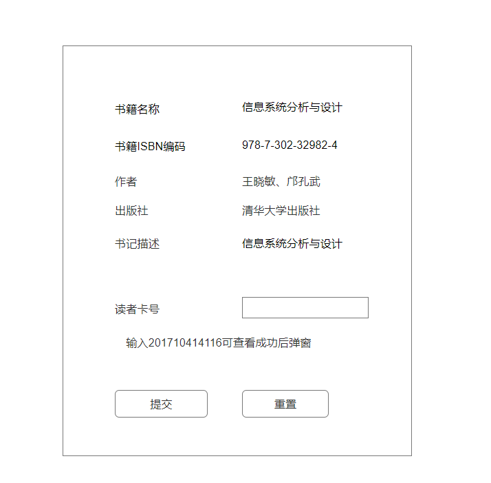
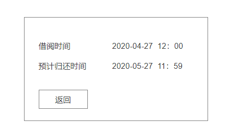

# 实验五 图书管理系统数据库设计与界面设计
## 1.数据库设计

### 1.1.管理员表
|字段|类型|主键、外键|可以为空|默认值|约束|说明|
|:---|:---|:---|:---|:---|:---|:---|
|id|varchar(100)|主键|否| | |职工号|
|name|varchar(100)| |否| | |姓名|
|rule|varchar(255)| |是| | |职工权限|

### 1.2.图书表
|字段|类型|主键、外键|可以为空|默认值|约束|说明|
|:---|:---|:---|:---|:---|:---|:---|
|id|int(10)|主键|否| | |图书编号|
|name|varchar(255)| |否| | |图书名称|
|stock|int(10)| |否|0| |当前图书库存|
|borrow_num|int(10)| |否|0| |图书已借阅量|

### 1.3.图书类型表
|字段|类型|主键、外键|可以为空|默认值|约束|说明|
|:---|:---|:---|:---|:---|:---|:---|
|id|int(10)|主键|否| | |图书类型编号|
|name|varchar(100)| |否| | |图书类型名称|

### 1.4.读者信息表
|字段|类型|主键、外键|可以为空|默认值|约束|说明|
|:---|:---|:---|:---|:---|:---|:---|
|id|varchar(100)|主键|否| | |编号|
|name|varchar(100)| |否| | |姓名|
|idnumber|varchar(16)| |否| | |身份证号|
|tel|varchar(100)| |否| | |联系方式|
|borrowed_num|int(10)| |否|0| |已借阅量|
|overtime_num|int(10)| |否|0| |逾期次数|

### 1.5.预定记录表
|字段|类型|主键、外键|可以为空|默认值|约束|说明|
|:---|:---|:---|:---|:---|:---|:---|
|id|int(10)|主键|否| | |编号|
|user_id|varchar(100)|外键|否| |读者信息表编号关联|读者编号|
|book_isbn|varchar(100)|外键|否| |图书信息表编号关联|图书编号|
|time|datetime| |否| | |预定时间|

### 1.6.借阅记录表
|字段|类型|主键、外键|可以为空|默认值|约束|说明|
|:---|:---|:---|:---|:---|:---|:---|
|id|int(10)|主键|否| | |编号|
|admin_id|varchar(100)|外键|否| |管理员信息表编号关联|管理员编号|
|user_id|varchar(100)|外键|否| |读者信息表编号关联|读者编号|
|book_isbn|varchar(100)|外键|否| |图书信息表编号关联|图书编号|
|time|datetime| |否| | |借阅时间|
|return_time|datetime| |否| | |归还时间|


## 2.界面设计
### 2.1界面设计github仓库地址
[ui展示](https://ThebestTang.github.io/is_analysis_pages/UI/page1.html)
### 2.2 界面设计图
#### 2.2.1 借阅图书界面设计图
##### 借阅图书填写界面截图

##### 借阅图书借阅成功界面截图


## 3.api设计
### 3.1 借阅图书api设计
#### 3.1.1. 借阅图书
- 功能：借阅图书
- 请求地址： http://api/
- 请求方法：POST
- 请求参数：

|参数名称|必填|说明|
|:-------:|:-------------: | :----------:|
|access_token|是|用于验证请求合法性的认证信息。 |
|method|是|默认为 get。|
|bookid|是|借阅图书id|
|userid|是|读者编号|

- 返回实例：
```
{
    "msg": "借阅成功",
    "data": {
        "time": "2020-04-27",
        "return_time": "2020-5-27",
        },
    "code": 200
}
```
- 返回参数说明：
    
|参数名称|说明|
|:-------:|:-------------: |
|msg|返回信息|
|data|借阅处理成功后返回的借阅信息|
|code|返回状态码|
