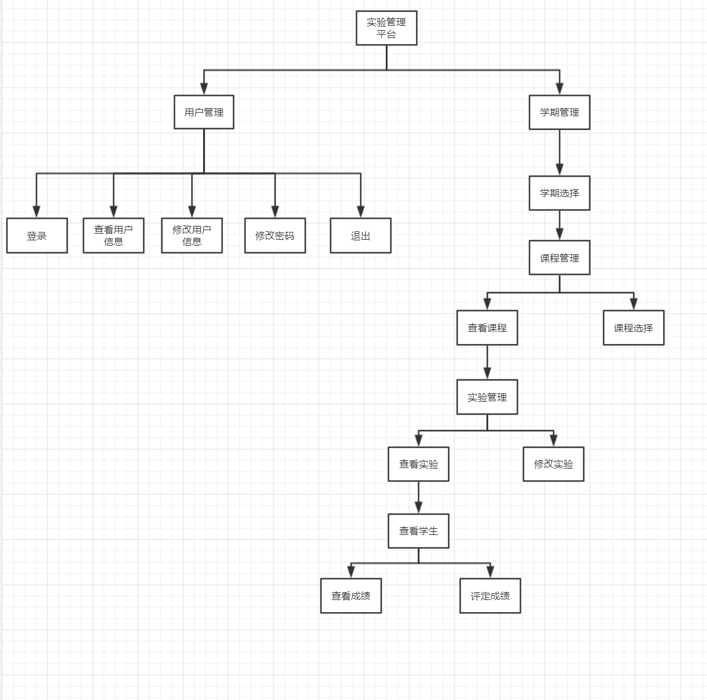
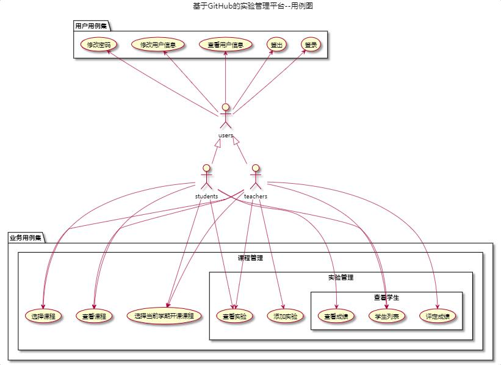
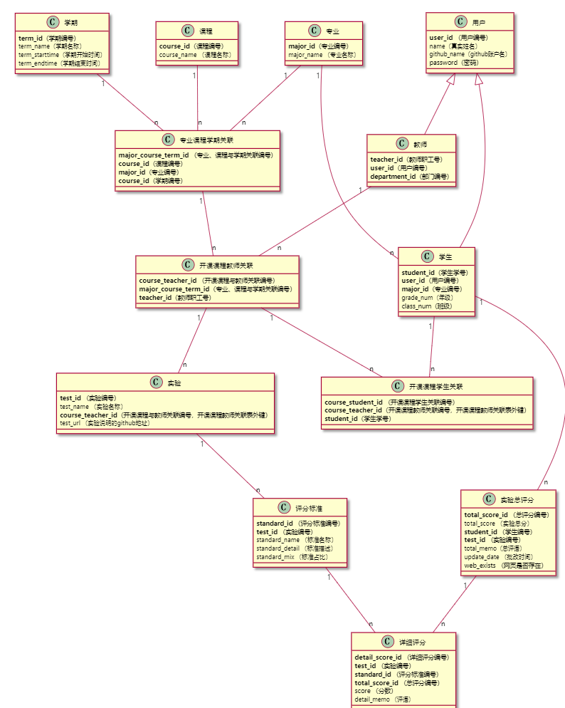

# 基于GitHub的实验管理平台的分析与设计

#### 成都大学信息科学与工程学院
|学号|班级|姓名|
|:---|:---|:---|
|201710414116|软件(本)17-1|汤顺|

## 1.概述

- 基于GitHub的实验管理平台的作用是在线管理实验成绩的Web应用系统。学生和老师的实验内容均存放在GitHUB 页面上。
- 学生的功能主要有：一是设置自己的GitHub用户名，二是查询自己的实验成绩,三是选择课程，四是查看实验。学生的GitHub用户名是公开的，但成绩不公开。
- 老师的功能主要有：一是批改每个学生的成绩，二是查看每个学生的成绩，三是选择课程。四是发布实验。
- 系统基于三多设置，多课程、多学期、多评分项。
- 老师和学生都能通过本系统的链接方便地跳转到学生的每个GitHUB实验目录，以便批改实验或者查看实验情况。
- 老师可以对每个发布实验自定义评分标准，评分标准动态设定。
- 实验成绩按数字分数计算，每项实验的满分为100分，最低为0分。
- 系统自动计算每个学生的所有实验的平均分。
## 2.系统总体结构 

## 3.用例图设计 [源码](源码/用例图设计.puml)

## 4.类图设计 [源码](源码/类图设计.puml)

## 5.数据库设计

[详情](数据库设计.md)

## 6.用例及界面详细设计
1.[登录用例](./用例/登录.md) [界面](https://thebesttang.github.io/is_analysis_pages/UI/登录.html)

2.[登出用例](./用例/登出.md) [界面](https://thebesttang.github.io/is_analysis_pages/UI/顶部菜单.html)

3.[修改密码](./用例/修改密码.md)  [界面](https://thebesttang.github.io/is_analysis_pages/UI/修改密码.html)

4.[修改用户信息](./用例/修改用户信息.md)  [界面](https://thebesttang.github.io/is_analysis_pages/UI/修改用户信息.html)

5.[查看用户信息](./用例/查看用户信息.md)  [界面](https://thebesttang.github.io/is_analysis_pages/UI/查看用户信息.html)

6.[选择课程](./用例/选择课程.md)  [界面](https://thebesttang.github.io/is_analysis_pages/UI/选择课程.html)

7.[查看课程](./用例/查看课程.md)  [界面](https://thebesttang.github.io/is_analysis_pages/UI/查看课程.html)

8.[查看学生信息](./用例/查看学生信息.md)  [界面](https://thebesttang.github.io/is_analysis_pages/UI/查看学生信息.html)

9.[查看实验](./用例/查看实验.md)  [界面](https://thebesttang.github.io/is_analysis_pages/UI/查看实验.html)

10.[添加实验](./用例/添加实验.md)  [界面](https://thebesttang.github.io/is_analysis_pages/UI/添加实验.html)

11.[查看成绩](./用例/查看成绩.md)  [界面](https://thebesttang.github.io/is_analysis_pages/UI/查看成绩.html)

12.[评定成绩](./用例/评定成绩.md)  [界面](https://thebesttang.github.io/is_analysis_pages/UI/评定成绩.html)
