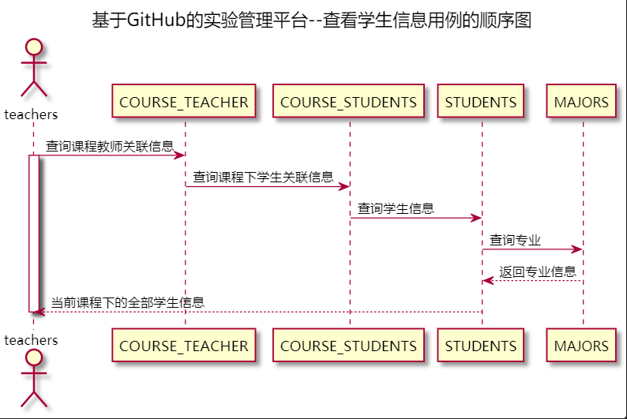

# “查看学生信息”用例 [返回](../README.md)

## 1. 用例规约

|用例名称|查看学生信息|
|-------|:-------------|
|功能|查看当前实验下的学生信息|
|参与者|学生/老师|
|前置条件| |
|后置条件| |
|主事件流| 1. 查询当前实验下的全部学生信息|
|备选事件流|1a.查询失败  &nbsp;&nbsp; 1.系统提示查询失败|

## 2. 业务流程 [源码](../源码/查看学生信息.puml)

## 3. 界面设计
- 界面参照: https://thebesttang.github.io/is_analysis_pages/UI/查看学生信息.html
- API接口调用
    - 接口1：[getCourseTestAllStudents](../接口/getCourseTestAllStudents.md)

## 4. 算法描述
    无
## 5. 参照表

- [STUDENTS](../数据库设计.md/#STUDENTS)
- [MAJORS](../数据库设计.md/#MAJORS)
- [COURSE_MAJOR_TERM](../数据库设计.md/#MAJOR_COURSE_TERM)
- [COURSE_TEACHER](../数据库设计.md/#COURSE_TEACHER)
- [TESTS](../数据库设计.md/#TESTS)