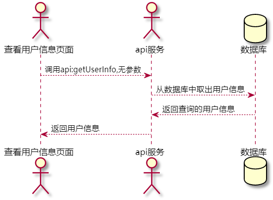

# “查看用户信息”用例 [返回](../README.md)
## 1. 用例规约

|用例名称|查看用户信息|
|-------|:-------------|
|功能|查看用户的所有信息|
|参与者|学生，老师|
|前置条件|必须先登录|
|后置条件| |
|主事件流| |
|备选事件流| |

## 2. 业务流程
    无

## 3. 界面设计
- 界面参照: https://thebesttang.github.io/is_analysis_pages/UI/查看用户信息.html
- API接口调用
    - 接口1：[getUserInfo](../接口/getUserInfo.md)

## 4. 算法描述[源码](../源码/查看用户信息.puml)

    
## 5. 参照表
- [STUDENTS](../数据库设计.md/#STUDENTS)
- [TEACHERS](../数据库设计.md/#TEACHERS)
- [USERS](../数据库设计.md/#USERS)