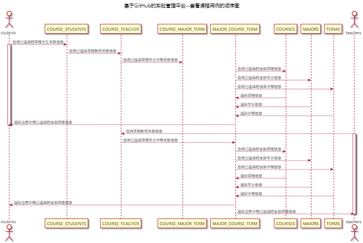

# “查看课程”用例 [返回](../README.md)

## 1. 用例规约

|用例名称|查看课程|
|-------|:-------------|
|功能|查看用户当前学期已选择课程|
|参与者|学生/老师|
|前置条件|用户已登录|
|后置条件||
|主事件流|1.查询需要查看课程的相关信息|
|备选事件流|1a.查询数据出错 &nbsp;&nbsp; 1.系统提示查询数据出错|

## 2. 业务流程 [源码](../源码/查看课程.puml)
 

## 3. 界面设计
- 界面参照:https://thebesttang.github.io/is_analysis_pages/UI/查看课程.html
- API接口调用
    - 接口1：[getCourseByTeacher](../接口/getCourseByTeacher.md)
    - 接口2：[getCourseByStudent](../接口/getCourseByStudent.md)
## 4. 算法描述
    无
## 5. 参照表

- [TEACHERS](../数据库设计.md/#TEACHERS)
- [STUDENTS](../数据库设计.md/#STUDENTS)
- [MAJORS](../数据库设计.md/#MAJORS)
- [COURSES](../数据库设计.md/#COURSES)
- [TERMS](../数据库设计.md/#TERMS)
- [COURSE_MAJOR_TERM](../数据库设计.md/#COURSE_MAJOR_TERM)
- [COURSE_TEACHER](../数据库设计.md/#COURSE_TEACHER)
- [COURSE_STUDENTS](../数据库设计.md/#COURSE_STUDENTS)