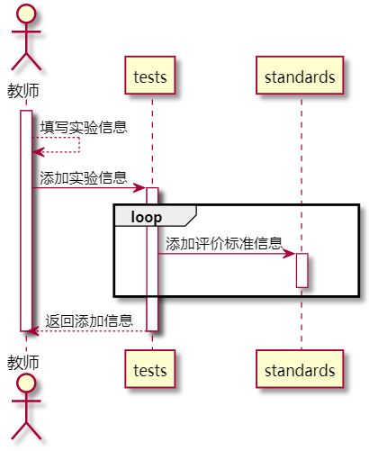

# “发布实验”用例 [返回](../README.md)
## 1. 用例规约

|用例名称|添加实验|
|-------|:-------------|
|功能|教师发布当前课程实验|
|参与者|老师|
|前置条件|必须先登录，并在查看实验页面下|
|后置条件| |
|主事件流| 1.教师填写课程实验及评价标准信息   2.教师提交实验信息  3.系统存储实验信息与评价标准信息|
|备选事件流|1a. 评价标准为空  &nbsp;&nbsp; 1.系统提示添加评价标准信息 2a.提交失败  &nbsp;&nbsp; 1.系统提示提交信息失败  2.重新提交 3a.系统存储失败  &nbsp;&nbsp; 1.系统提示数据存储失败   2.重新提交 |

## 2. 业务流程 [源码](../源码/添加实验.puml)

## 3. 界面设计
- 界面参照: https://thebesttang.github.io/is_analysis_pages/UI/添加实验.html
- API接口调用
    - 接口1：[setNewCourseTest](../接口/setNewCourseTest.md)
    
## 4. 算法描述 
    无
## 5. 参照表
- [TESTS](../数据库设计.md/#TESTS)
- [STANDARDS](../数据库设计.md/#STANDARDS)